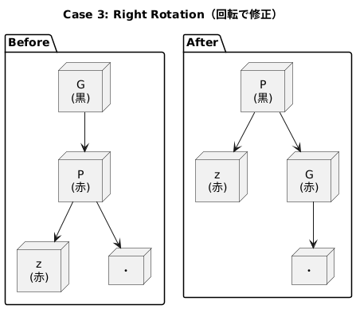

## Repository
https://github.com/nginx/nginx

### diagram
.png>)

## UML
イベント駆動型アーキテクチャに焦点を当ててアーキテクチャを眺めてみる。

### class


- ngx_cycle_t: NGINXのライフサイクルを管理し、すべての接続やイベントを保持する。
- ngx_connection_t: クライアント接続を表し、読み取りイベント（read）と書き込みイベント（write）を管理する。
- ngx_event_t: イベントを表し、非同期I/O操作を処理する。
- ngx_event_actions_t: イベントの追加、削除、処理を行う関数ポインタを提供する。
- ngx_accept_mutex: 複数のワーカープロセス間で接続を制御するためのミューテックス。

### sequence


- ユーザーからのリクエストが到着すると、ngx_cycle_tがaccept_mutexを取得して接続を処理する。
- イベントループ（process_events）が呼び出され、準備ができたイベントを処理する。
- イベントが処理されると、接続の読み取り/書き込みが行われる。

### state transition


- イベント（ngx_event_t）は、初期状態（Inactive）から開始し、イベントが追加されるとActiveになる。
- イベントが準備完了（Ready）になると、ハンドラーが呼び出されて処理が行われる。
- 処理が完了すると、再びActiveまたはInactiveに戻る。

## code
### ngx_event.c
NGINXのイベント駆動型アーキテクチャの中核を担う。イベント処理の初期化、設定、実行を管理。このファイルでは、epoll や kqueue などのOS依存のイベントドライバを選択・設定する機能（ngx_event_use）や、接続数や排他制御（accept_mutex）の設定（ngx_event_connections）が実装されている。また、ngx_process_events_and_timers によるイベントループの実行や、タイマーの期限切れ処理が効率的に行われる。さらに、ngx_event_core_create_conf と ngx_event_core_init_conf による設定構造体の作成・初期化により、柔軟な設定が可能。高負荷環境でもスケーラブルで効率的な非同期I/O処理を実現している。


- ngx_event_process_init
  - ワーカープロセスの初期化を行い、イベントモジュールや接続プールを準備する。
- ngx_event_module_init:
  - 共有メモリや排他制御用のaccept_mutexを初期化する。
- ngx_event_core_create_conf / ngx_event_core_init_conf:
  - イベント関連の設定構造体を作成・初期化する。
- ngx_handle_read_event / ngx_handle_write_event:
  - 読み取り・書き込みイベントの登録や削除を処理する。
- ngx_events_block:
  - eventsブロックの設定を解析し、イベントモジュールを初期化する。
- ngx_event_connections / ngx_event_use:
  - worker_connectionsやuseディレクティブを設定する。
- ngx_process_events_and_timers:
  - イベントループの中核処理を行い、タイマーやイベントを管理する。

### ngx_connection.c
NGINXの接続管理の中核を担い、効率的でスケーラブルな接続処理を実現している。接続のライフサイクル（取得、使用、解放）を明確に分離し、 [ngx_get_connection](https://github.com/nginx/nginx/blob/b6e7eb0f5792d7a52d2675ee3906e502d63c48e3/src/core/ngx_connection.c#L1174-L1237) や  [ngx_free_connection](https://github.com/nginx/nginx/blob/b6e7eb0f5792d7a52d2675ee3906e502d63c48e3/src/core/ngx_connection.c#L1240-L1250) を通じて接続プールを管理することで、リソースの効率的な利用を可能に。また、 [ngx_tcp_nodelay](https://github.com/nginx/nginx/blob/b6e7eb0f5792d7a52d2675ee3906e502d63c48e3/src/core/ngx_connection.c#L1521-L1561) や   [ngx_configure_listening_sockets](https://github.com/nginx/nginx/blob/b6e7eb0f5792d7a52d2675ee3906e502d63c48e3/src/core/ngx_connection.c#L715-L1092) によるソケットオプションの柔軟な設定により、低遅延通信や高負荷環境への対応が可能。さらに、 [ngx_reusable_connection](https://github.com/nginx/nginx/blob/b6e7eb0f5792d7a52d2675ee3906e502d63c48e3/src/core/ngx_connection.c#L1341-L1369) や  [ngx_drain_connections](https://github.com/nginx/nginx/blob/b6e7eb0f5792d7a52d2675ee3906e502d63c48e3/src/core/ngx_connection.c#L1372-L1426) による再利用可能な接続の管理は、接続プールの枯渇を防ぎ、安定性を向上させる。全体として、接続管理の設計は高い拡張性と信頼性を備えている。


- ngx_create_listening:
  - リスニングソケットを作成し、sockaddrやソケットオプションを初期化する。
- ngx_clone_listening:
  - ワーカープロセスごとにリスニングソケットを複製する。
  - SO_REUSEPORT を使用して複数プロセス間でソケットを共有する。
- ngx_set_inherited_sockets:
  - 親プロセスから引き継いだソケットを設定する。
  - ソケットオプションを取得し、sockaddrを初期化する。
- ngx_open_listening_sockets:
  - リスニングソケットを開き、必要なソケットオプションを設定する。
- ngx_configure_listening_sockets:
  - リスニングソケットに追加のオプション（例: TCP_FASTOPEN）を設定する。
- ngx_close_listening_sockets:
  - すべてのリスニングソケットを閉じ、関連リソースを解放する。
- ngx_get_connection:
  - 接続プールから空いている接続を取得し、読み取り/書き込みイベントを初期化する。
- ngx_free_connection:
  - 接続を解放し、接続プールに戻する。
- ngx_close_connection:
  - 接続を閉じ、関連するイベントを削除し、リソースを解放する。
- ngx_reusable_connection:
  - 接続を再利用可能または非再利用可能としてマークする。
  - 再利用可能な接続キューを更新する。
- ngx_drain_connections:
  - 接続プールが不足した場合に接続を再利用する。
- ngx_close_idle_connections:
  - アイドル状態の接続を閉じ、クリーンアップする。
- ngx_connection_local_sockaddr:
  - 接続のローカルアドレスを取得し、文字列形式でフォーマットする。
- ngx_tcp_nodelay:
  - 接続に対して TCP_NODELAY を有効にし、低遅延通信を実現する。
- ngx_connection_error:
  - 接続関連のエラーをログに記録し、特定のエラーコードを処理する。

## 要約
### 14.1. Why Is High Concurrency Important?

インターネットの発展により、同時接続数（高並行性）が劇的に増加し、Webアーキテクチャは大きく変化した。従来はクライアントの回線速度がボトルネックだったが、現在はモバイル端末やブラウザの仕様（複数接続）により、常時多数の接続を処理する必要がある。Apacheのような従来型Webサーバは接続ごとにプロセスやスレッドを生成するためスケーラビリティに限界があり、CPUやメモリを圧迫しやすい。これに対しnginxはイベント駆動型で、軽量な構造により数万の同時接続にも対応可能であり、C10K問題（1万同時接続）を解決する代表的なアプローチとなった。nginxは静的コンテンツ配信、SSL処理、キャッシュなどを効率的に処理でき、アプリケーション層の負荷を軽減することで高性能・高並行性なWebインフラ構築を実現する。

### 14.2. Overview of nginx Architecture

従来のWebサーバ（例：Apache）は、接続ごとにプロセスやスレッドを生成し、I/O操作でブロックされやすい構造だった。これによりメモリ・CPU効率が悪く、大量の同時接続を処理するには不向きだった。一方nginxは、非同期・イベント駆動・シングルスレッドの設計を採用し、1つのワーカープロセス内で数千の接続を同時に処理できる高効率な構造を持つ。各ワーカーはOSのイベント通知（epoll、kqueueなど）を活用し、非ブロッキングに接続・応答処理を行う。プロセス生成のオーバーヘッドがないため、CPUやメモリの消費を抑えながら高負荷にも対応可能である。

nginxはモジュール構造を持ち、処理機能（リクエスト受信、プロキシ、圧縮、キャッシュなど）を柔軟に追加・拡張できる。現在は動的モジュールの読み込みには未対応だが、将来的に対応予定。nginxはマスター・ワーカー・キャッシュ関連の専用プロセス（ローダーとマネージャ）から構成され、マスターが設定読込やプロセス管理を行い、ワーカーが実際のリクエスト処理を担当する。

キャッシュは階層的なファイルシステム上に実装され、レスポンスは一時ファイルとして保存後、キャッシュディレクトリへ移動される。メタデータは共有メモリ上に保持され、キャッシュローダーが起動時に初期化し、キャッシュマネージャーが期限切れ処理を常駐で行う。

nginxは複数のCPUコア上で効率的にスケール可能で、コア数とワーカー数を適切に調整することで高パフォーマンスが得られる。CPU負荷が高い場合はコア数と同数、ディスクI/Oが主体の場合はコア数の1.5〜2倍のワーカー数が推奨される。また、将来的な課題として、ディスクI/Oによるブロッキングや埋め込みスクリプト処理の安定性向上が挙げられている。

総じて、nginxは高並行性処理、高効率、拡張性を重視した設計であり、現代のWebアーキテクチャに適したWebサーバとなっている。

### 14.3. nginx Configuration
nginxの設定システムは、Apacheの複雑な構成管理の経験から着想を得ており、スケーラブルかつ整理しやすい設計が特徴である。設定は通常`/etc/nginx`にあるプレーンテキストファイル（主に`nginx.conf`）に集中管理され、Apacheの`.htaccess`のような分散設定はサポートされていない。構成はCスタイルの構文で、論理的かつ自動化しやすい。設定はmain, http, server, locationなど文脈（context）ごとに明確に分かれており、重複や曖昧さを避ける設計になっている。nginx独自の機能として、効率的な条件分岐が可能な`try_files`や、高速評価される変数機構があり、柔軟なリクエスト処理を実現している。これらにより、大規模かつ複雑なWeb構成でも保守性と拡張性を両立できる。

### 14.4. nginx Internals
nginxはコアと多数のモジュールから構成され、コアはネットワーク処理やプロキシの基盤を提供し、プロトコルやアプリケーション固有の処理は主にモジュールが担当する。接続処理はパイプライン形式で行われ、各処理段階で異なるモジュールが動作する。httpやmailといった中間モジュールは、コアと機能モジュールの間の抽象化層として、HTTPやSMTPなどのイベント順序を制御する。

機能モジュールは、イベント、フェーズハンドラ、フィルタ、変数、プロトコル、アップストリーム、ロードバランサなどに分類される。HTTPリクエストはフェーズに従って処理され、各フェーズにハンドラが存在し、出力はフィルタによって段階的に変換される。nginxのフィルタはUnixのパイプラインのように連続的に処理され、応答ヘッダとボディは別々にフィルタ処理される。フィルタの順序はコンパイル時に決まり、将来的には入力フィルタも導入予定。

特に注目すべきは「サブリクエスト」の機構で、あるリクエストの中から別のリソースを取得して組み込むことができ、階層的なネストも可能。これによりSSI（Server Side Include）などの機能が実現されている。

アップストリームモジュールはバックエンドへのリクエスト送信とレスポンス受信を管理し、ロードバランサは複数のバックエンドから適切なサーバを選択する。nginxは標準でラウンドロビンとIPハッシュの方式をサポートし、障害検出と再ルーティング機能も持つ。今後、より高度なヘルスチェックや分散アルゴリズムが追加される予定である。

変数ハンドラとしては`geo`と`map`があり、IPアドレスや他の変数から動的に変数を生成できる。これにより柔軟な設定が可能となっている。

メモリ管理面では、nginxはプロセス単位でメモリプールを使い、接続ごとに必要なバッファを動的に確保し、ポインタで効率的にデータを扱う。バッファはチェーン構造で処理され、モジュールによってはバッファ操作の複雑な判断が必要になる。nginxはスラブアロケータを使って共有メモリ領域を管理し、キャッシュメタデータなどは共有メモリ上の赤黒木構造(補足)で保持される。

nginxのモジュール開発は柔軟性が高いが、内部仕様の文書が不足しており、開発は難解で高度な理解を要する。Evan Millerらによるドキュメントが存在するものの、多くは逆解析の成果に基づく。開発者向けAPIやドキュメントの整備が進行中であり、今後より開かれた拡張開発が期待される。

それでも近年はLua埋め込みモジュールや高度なロードバランシング、WebDAV、キャッシュ制御など多くの有用なサードパーティ製モジュールが登場しており、nginxのエコシステムはさらに広がっている。

### 14.5. Lessons Learned

nginxの開発から得られた教訓は、「常に改善の余地がある」ということに始まる。初期のコード設計とアーキテクチャはソフトウェアの将来を左右する重要な要素であり、開発は集中すべきである。たとえばWindows版の開発は、リソースの分散による限界を示す例である。また、nginxの普及には小規模ながらも優れた外部開発者たちによるサードパーティモジュールの貢献が大きく、今後も重要な役割を担う。


## 補足
### 赤黒木
木がバランスを崩さないように、赤と黒の“色付き”ルールで調整する二分探索木。普通の二分探索木（BST）は、要素を追加していくと「片側に偏る」ことがあるが、赤黒木では、ノードに「赤」または「黒」という色を付けて、木の高さが不必要に高くなるのを防ぐ。探索・挿入・削除の計算量を O(log n) に保つためのルールを使って、自己バランスをとる。

### コード
赤黒木の基本的な操作は、
https://github.com/nginx/nginx/blob/b6e7eb0f5792d7a52d2675ee3906e502d63c48e3/src/core/ngx_rbtree.c#L24-L93
あたり実装されている。

```c
void
ngx_rbtree_insert(ngx_rbtree_t *tree, ngx_rbtree_node_t *node)
{
    ngx_rbtree_node_t  **root, *temp, *sentinel;
    
    /* a binary tree insert */
    root = &tree->root;
    sentinel = tree->sentinel;

    //空の木なら root として初期化（黒設定）
    if (*root == sentinel) {
        node->parent = NULL; //親なし（根ノード）
        node->left = sentinel;//空ノードで初期化
        node->right = sentinel;//空ノードで初期化
        ngx_rbt_black(node);//赤黒木のルールで根ノードは黒
        *root = node;
        return;
    }

    //挿入すべき位置を決める
    tree->insert(*root, node, sentinel);

    /* re-balance tree */

    //赤が連続している時にループが回り続ける
    while (node != *root && ngx_rbt_is_red(node->parent)) {
        if (node->parent == node->parent->parent->left) {
```

```c
            //ケース1（叔父が赤）→ 色の付け替えのみ
            temp = node->parent->parent->right;

            if (ngx_rbt_is_red(temp)) {
                ngx_rbt_black(node->parent);        //親を黒にする
                ngx_rbt_black(temp);                //叔父を黒にする
                ngx_rbt_red(node->parent->parent);  //祖父を赤にする
                node = node->parent->parent;        //node = grandparent にして再起的にループを継続する
```


```c
            } else {
                // ケース2 → 三角形を直線に整形する回転
                // 親が赤、叔父は黒、かつ node が「右子」→ 三角形の構造
                if (node == node->parent->right) {
                    node = node->parent;
                    ngx_rbtree_left_rotate(root, sentinel, node); //左回転して「直線形」に整える
                }
```

```c
                //ケース3 → 回転して修正
                ngx_rbt_black(node->parent);//親を黒にする
                ngx_rbt_red(node->parent->parent);//祖父を赤にする
                ngx_rbtree_right_rotate(root, sentinel, node->parent->parent);//右回転でバランスをとる
                
```

```
直線構造を

     G(黒)
    /
  P(赤)
  /
z(赤)

右回転：Pを上に持ち上げて、Gが相対的に下に降りてくるようなイメージ

    P(黒)
   /   \
z(赤)  G(赤)

```
```c
            }
        } else {
            temp = node->parent->parent->left;
            if (ngx_rbt_is_red(temp)) {
                ngx_rbt_black(node->parent);
                ngx_rbt_black(temp);
                ngx_rbt_red(node->parent->parent);
                node = node->parent->parent;
            } else {
                if (node == node->parent->left) {
                    node = node->parent;
                    ngx_rbtree_right_rotate(root, sentinel, node);
                }
                ngx_rbt_black(node->parent);
                ngx_rbt_red(node->parent->parent);
                ngx_rbtree_left_rotate(root, sentinel, node->parent->parent);
            }
        }
    }
    ngx_rbt_black(*root);//ルートを黒に
}
```

キャッシュメタデータの具体的な管理は、
https://github.com/nginx/nginx/blob/b6e7eb0f5792d7a52d2675ee3906e502d63c48e3/src/http/ngx_http_file_cache.c#L2272-L2324
あたりで実装されている。

キャッシュエントリを赤黒木に挿入・削除する処理が行われている。この設計により、キャッシュエントリの操作が効率的に行われ、高速なキャッシュ管理が実現できる。（計算量はO(log n)）