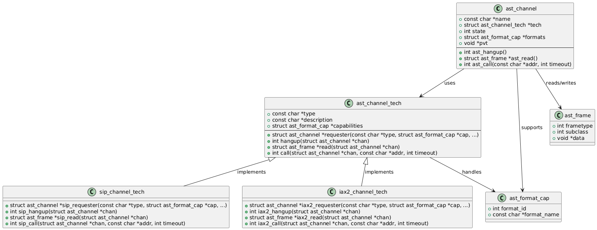
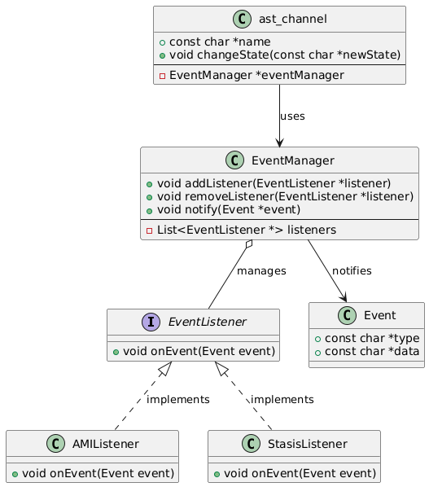

## ripository
https://github.com/asterisk/asterisk

## diagram

https://gitdiagram.com/asterisk/asterisk

```
.
└── Diagram/
    ├── Core PBX Engine/
    │   ├── main(core)/
    │   │   ├── Asterisk本体の中心的処理。
    │   │   ├── スレッド制御、イベントループ、チャンネル制御、モジュール管理など。
    │   │   └── 例：main/asterisk.c, main/channel.c
    │   └── include(APIs)/
    │       ├── 構造体やインターフェース定義（ast_channel, ast_frame など）を集約。
    │       ├── モジュール間のAPI境界を提供。
    │       └── 例：include/asterisk/channel.h, include/asterisk/module.h
    │
    ├── Modules/Plugins/
    │   ├── apps(call features)/
    │   │   ├── ダイヤルプランから呼び出される各種機能（録音、転送、再生、Voicemailなど）を提供。
    │   │   └── 例：app_voicemail.c, app_dial.c, app_playback.c
    │   ├── channels(technology interfaces)/
    │   │   ├── 外部ネットワークとの接続を担当するドライバ（SIP、PJSIP、DAHDI、IAX2など）。
    │   │   ├── Asteriskのチャンネル抽象APIと、各種プロトコルとの橋渡しを行う。
    │   │   └── 例：chan_pjsip.c, chan_iax2.c
    │   ├── bridge(call mixing)/
    │   │   ├── 複数チャンネルのブリッジ（音声ミキシング）ロジック。
    │   │   ├── ネイティブブリッジや汎用ブリッジの切替処理。
    │   │   └── 例：bridge_builtin_features.c
    │   ├── codecs(media processing)/
    │   │   ├── 音声・映像のコーデック変換（transcoding）機能。
    │   │   ├── 低帯域から高音質コーデックまでをサポート。
    │   │   └── 例：codec_gsm.c, codec_opus.c
    │   └── funcs(dialplan functions)/
    │       ├── ダイヤルプランで使う関数（CallerID, CDR, 文字列操作など）を提供。
    │       └── 例：func_callerid.c, func_logic.c
    │
    ├── Testing and Dependencies/
    │   ├── tests(ci/tests)/
    │   │   ├── ユニットテストや機能テストコード。
    │   │   ├── 通話処理やアプリケーションの自動検証用。
    │   │   └── Asterisk Test Frameworkを使用。
    │   └── third-party(dependencies)/
    │       ├── サードパーティ製ライブラリ（resample、pjprojectなど）。
    │       └── 一部ライブラリはビルドにバンドル可。
    │
    ├── External Interfaces and Integrations/
    │   ├── res(external resources)/
    │   │   ├── 外部システムとの連携、音声資源管理、MusiconHold、データベース接続など。
    │   │   └── 例：res_ari.c, res_musiconhold.c, res_odbc.c
    │   ├── rest api templates/
    │   │   ├── Asterisk ARI (Asterisk REST Interface) 用テンプレート。
    │   │   └── Webベースでの制御やイベント取得に使われる。
    │   ├── phoneprov(provisioning)/
    │   │   ├── IP電話端末のプロビジョニングサポート。
    │   │   └── 電話機の自動設定ファイルを生成。
    │   └── rest api integration/
    │       ├── ARI/AMIによる外部制御API。
    │       ├── HTTP/WSベースでのイベント購読と操作。
    │       └── 例：res_ari*, res_stasis*
    │
    ├── Configuration and Build/
    │   ├── configs/samples(sample file)/
    │   │   ├── Asteriskの設定ファイルのサンプル群。
    │   │   └── extensions.conf, sip.conf, voicemail.conf などの雛形。
    │   ├── configs(config file)/
    │   │   ├── 実運用で使用される設定ファイル群。
    │   │   └── モジュール、チャンネル、アプリの動作を定義。
    │   └── menuselect(module selection)/
    │       ├── Asteriskビルド時に有効/無効にするモジュール選択ツール。
    │       └── CUIインターフェースで依存関係を確認しながら選べる。
    │
    └── Documentation/
        └── doc/
            ├── Doxygen用ドキュメントやAPI仕様
            ├── モジュールの概要説明、設定オプションなど
            └── 例：doc/tex、doc/core-en.txt

```
### デザインパターン

#### ストラテジーパターン

- コンテキスト（ast_channel）
  - チャネルの操作を行う主体で、ast_channel_techを利用して具体的な処理を委譲する。
- ストラテジー（ast_channel_tech）
  - 異なるチャネル技術に共通のインターフェースを提供する。
- 具体的なストラテジー（sip_channel_tech, iax2_channel_tech, dahdi_channel_tech）
  - 各チャネル技術に特化した処理を実装。


#### テンプレートパターン
- 抽象クラス（ast_channel_tech）
  - 共通の処理フローを定義し、フックメソッド（requester, hangup, read, call）を提供する。
- 具体的な実装（sip_channel_tech, iax2_channel_tech）:
  - フックメソッドをオーバーライドして、SIPやIAX2などの技術に特化した処理を実装する。
- 共通フローの利用（ast_channel）
  - ast_channelはast_channel_techを利用して、チャネル技術に依存しない形で操作を実行する。



#### オブザーバーパターン

- Subject（EventManager）
  - イベントリスナーを管理し、イベントを通知する役割を持つ。
- Observer（EventListener）
  - イベントを受け取り、処理を行うインターフェースを提供する。
- 具体的なObserver（AMIListener, StasisListener）
  - EventListenerを実装し、AMIやStasisのイベント処理を行う。
- イベント発生元（ast_channel）
  - 状態変更などのイベントを発生させ、EventManagerを通じて通知を行う。



#### ファクトリーパターン

- Factoryの役割（ast_request）
  - チャネルの生成を一元管理する
  - チャネルの種類に応じて、適切なチャネル技術を選択し、チャネルオブジェクトを生成しする。
- 生成されるオブジェクト（ast_channel）
  - Factoryによって生成される具体的なチャネルオブジェクト。
- チャネル技術（ast_channel_tech）
  - チャネル生成のためのインターフェースを提供する。
- 具体的なチャネル技術（sip_channel_tech, iax2_channel_tech, dahdi_channel_tech）
  - チャネル技術ごとの生成処理を実装する。


#### アダプターパターン
- Adapter（ast_channel_tech）
  - 異なるチャネル技術（SIP, IAX2, DAHDIなど）を統一的に扱うためのインターフェースを提供する。
- Concrete Adapter（sip_channel_tech, iax2_channel_tech, dahdi_channel_tech）
  - 各プロトコルに特化した処理を実装し、ast_channel_techインターフェースを通じて提供する。
- Client（ast_channel）
  - ast_channel_techを利用して、チャネル技術に依存しない形で操作を実行する。


## 概要
Asteriskは、GPLv2ライセンスで配布されるオープンソースの電話アプリケーションプラットフォームで、電話の発着信やカスタム処理を行うサーバーアプリケーションです。1999年にMark Spencerが自身の会社Linux Support Servicesの電話システムとして開発を開始し、その後会社名をDigium, Inc.に変更しました。

Asteriskの名前はUnixのワイルドカード文字「*」に由来し、「すべての電話関連機能を実現する」ことを目標としています。VoIPプロトコルやPSTN（公衆交換電話網）との接続を含む多様な技術をサポートし、電話の入出力が可能です。また、留守番電話のような大規模なアプリケーションや、音声ファイル再生や音声認識などの小規模な機能を組み合わせてカスタム音声アプリケーションを構築できます。


## コアコンセプト

### 1. Channels（チャンネル）
- 定義：Asteriskとテレフォニーエンドポイント（電話機など）との接続を表す。
- 構造体：`ast_channel` によって実装され、通話の一片（シングルコールレッグ）を担う。
- 例：電話がAsteriskにかけてきてボイスメールに接続されたとき、その接続は1つのチャンネルで表現される。

### 2. Channel Bridging（チャンネルブリッジング）
- 定義：2つのチャンネルを接続してメディア（音声・映像・テキスト）をやり取りできるようにするチャンネル同士の接続処理。
- 2つの方式：
  - Generic Bridging：技術に依存しない柔軟な接続方法。ただし効率は低い。
  - Native Bridging：同じ技術を使ったチャンネル間での直接接続（例：同じVoIPプロトコル）。効率が高い。
- 特徴：接続方式の選定は、チャンネルがサポートするネイティブ方式の比較（関数ポインタ）で決まる。

### 3. Frames（フレーム）
- 定義：チャンネルを通じてやりとりされる具体的なデータ単位。`ast_frame` 構造体として存在。
- フレームの種類：
  - VOICE：音声データの一部を運ぶ。
  - VIDEO：映像データを運ぶ。
  - MODEM：FAXなど非音声データを扱う。
  - CONTROL：通話状態（保留、切断など）の通知。
  - DTMF_BEGIN / DTMF_END：キー入力の開始・終了。
- 特徴：メディアフレームとシグナリングフレームに分かれ、信号やデータがAsterisk内部を流れる形式。


## コンポーネントの抽象化

Asteriskがどのようにモジュールベースのアーキテクチャを構築しているか、そしてどのように柔軟性と拡張性を実現しているか。

### 全体像：モジュールによる柔軟な構成

- Asterisk本体（core application）は、`main/`ディレクトリのコードから成る。
- 本体は「モジュールのレジストリ」として機能し、実際の処理はモジュールに依存。
- モジュールは起動時に動的に読み込まれ、各種機能（チャンネル、アプリケーション、関数、コーデックなど）を登録する。
- 必要なモジュールだけを読み込むことで、軽量化やセキュリティ向上が可能。

### 1.2.1 Channel Drivers（チャンネルドライバ）

#### 概要：
- チャンネルドライバは、SIP・PSTN・WebRTCなど通信技術の違いを抽象化するための最重要コンポーネント。
- `ast_channel_tech`インターフェースを実装することでAsteriskに組み込まれる。
- 電話網との接続（SIP, PSTN など）
- 定義ファイル: include/asterisk/channel.h
  - ast_channel_tech 構造体

#### 主な関数（コールバック）：
| 関数 | 説明 |
|------|------|
| `requester` | チャンネル生成要求 |
| `call` | 発信処理 |
| `answer` | 着信応答 |
| `hangup` | 切断処理 |
| `indicate` | 通話中の状態通知（保留など） |
| `send_digit_*` | DTMF信号の送信 |
| `read` / `write` | メディアの読み書き（`ast_frame`） |
| `bridge` | ネイティブブリッジの最適化 |

---

### 1.2.2 Dialplan Applications（ダイヤルプランアプリ）

#### 概要：
- `/etc/asterisk/extensions.conf` に記述される「ダイヤルプラン」で通話フローを定義。
- 各通話処理ステップで呼び出される「アプリケーション」を実行。
- 通話中に行う処理（録音、再生など）
- アプリは以下のようなことが可能：
  - 音声再生（Playback）
  - 数値読み上げ（SayDigits）
  - 録音、通話転送、ボイスメール、など
- 定義ファイル: main/pbx.c
  - ast_register_application() 関数

### 1.2.3 Dialplan Functions（ダイヤルプラン関数）

#### 概要：
- アプリに渡す動的な引数や変数の取得・設定に使用。
- 通話情報の取得・設定（変数・状態）
- `Set()` や `Verbose()` などと組み合わせて使う。
- 定義ファイル: main/pbx.c
  - ast_custom_function_register() 関数
- 例：CALLERID関数、CDR関数など（構造体から情報を引き出す）


### 1.2.4 Codec Translators（コーデック変換）

#### 概要：
- 音声や映像のエンコード方式の変換を担う。
- 音声・映像の形式変換
- 通常は同じコーデックを使わせようとするが、必要に応じてtranscodingを行う。
- 定義ファイル: main/translate.c
  - __ast_register_translator() 関数
- 例：録音のために一時的にPCMに変換するなど。

#### 実装：
- `ast_translator` インターフェースを使って、モジュールとして登録。
- 音声の内容は知らず、コーデック変換のみを行う単純な処理。

## 1.3 スレッド
- AsteriskはPOSIXスレッド（pthread）を使って実装されたマルチスレッドシステム。
- スレッドのラッパーAPI（デバッグ対応）経由で一貫した操作を実施。
- 主に2種類のスレッドに分類される：
  1. ネットワークモニタスレッド
  2. チャンネルスレッド

### 1.3.1 Network Monitor Threads（ネットワークモニタスレッド）

役割：通信の「監視」担当

- 各種チャンネルドライバ（例: SIP, PJSIP, DAHDIなど）に属する。
- IPネットワークや電話網（PSTN）からの着信監視・初期接続処理を行う。
- 以下の処理を担う：
  - 着信検知
  - 認証
  - ダイヤル番号の検証
- 処理が成功すると：
  - `ast_channel` を生成
  - 専用の チャンネルスレッド を起動

### 1.3.2 Channel Threads（チャンネルスレッド）

役割：通話中の「処理実行」担当

- 各通話ごとに 1スレッド。
- Asteriskのダイヤルプランを実行する中核スレッド。
- dialplan application（Playbackなど） や function（CALLERIDなど） の実行もこのスレッドで行われる。
- `ast_channel`構造体のライフサイクルを完全に管理する「オーナー」。


1.4 通話シナリオ

これまで紹介されたコンポーネント（チャンネル、アプリケーション、ドライバ、スレッド）が実際の通話処理でどう連携するか。

### 1.4.1 ボイスメール確認（Checking Voicemail）

1. 着信受信：
   - チャンネルドライバのモニタスレッドが着信を検知
   - 認証・番号確認を実行

2. チャンネル生成：
   - `ast_channel` を作成し、チャンネルスレッドを開始

3. ダイヤルプラン実行：
   - たとえば `*123` に着信があった場合：

     ```asterisk
     exten => *123,1,Answer()
         same => n,VoicemailMain()
     ```

   - `Answer()` で通話に応答（←技術ごとの処理あり）
   - `VoicemailMain()` を呼び出し、音声ガイダンスで操作案内

4. DTMF入力と再生：
   - ボイスメールアプリはキー入力（DTMF）を処理
   - 必要に応じてコーデック変換（録音・再生ファイル形式と通信の不一致解消）

5. 通話終了：
   - ユーザーが電話を切る
   - ハングアップ信号を検知し、チャンネルスレッドが終了処理を行う

### 1.4.2 通話ブリッジ（Bridged Call）

1. 発信着信のセットアップは Voicemail 時と同じ。

2. ダイヤルプラン実行：

   ```asterisk
   exten => 1234,1,Dial(SIP/bob)
   ```

   - `Dial(SIP/bob)` により、SIPのチャンネルドライバが `bob` の端末に発信
   - 応答があるまで待ち、成功したら両方のチャンネルが「応答済み」になる

3. チャンネルブリッジ開始：
   - 双方のチャンネルをブリッジして、音声・イベントを相互に転送
   - 音声データ（`ast_frame`）の処理がリアルタイムで行われる

4. 通話終了：
   - どちらかが切ると、両チャンネルに `hangup` を適用し、スレッドが終了
