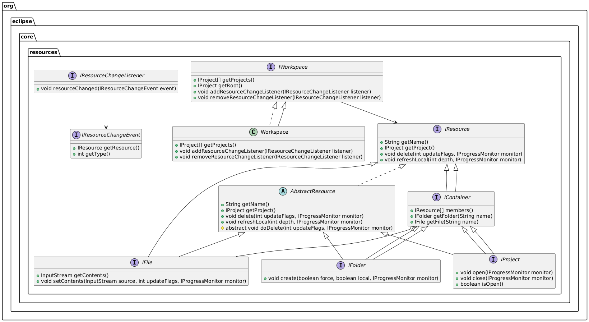

## Repository
https://github.com/eclipse-platform/eclipse.platform

## Design Pattern
Eclipseのリソース管理は、ファイルシステムの抽象化を提供し、プロジェクトやフォルダ、ファイルを統一的に扱えるように設計されている。

### Composite パターン
IResourceを基底インターフェースとし、IContainer（フォルダやプロジェクト）とIFile（ファイル）を統一的に扱えるようにしている。階層構造を持つリソース（フォルダやプロジェクト）と単一リソース（ファイル）を同じインターフェースで操作可能。再帰的な操作（例: フォルダ内のすべてのファイルを処理する）が容易になる。
### Observer パターン
IWorkspaceがリスナー（IResourceChangeListener）を管理し、リソースの変更が発生した際に通知する。リソースの変更を監視し、動的に処理を実行可能。リスナーを追加するだけで、変更通知を受け取れるため、拡張性が高い設計。
### Facade パターン
IWorkspaceがリソース管理のエントリーポイントとして機能し、複雑なリソース操作を簡単に利用できるようにしている。リソース管理の複雑さを隠蔽し、簡潔なAPIを提供。クライアントコードが直接複雑な内部構造に依存しないようにする。
### Template Method パターン
AbstractResourceクラスが共通の処理を提供し、具体的な動作をサブクラス（IFile, IFolder, IProject）に委譲する。共通の処理を基底クラスに定義し、具体的な処理をサブクラスで実装。コードの再利用性を向上させ、サブクラスごとのカスタマイズを容易にする。

## 概要
Eclipseは2001年に登場したオープンソースの統合開発環境（IDE）であり、その特徴はツールの集合ではなく、拡張可能でモジュール化された開発プラットフォームである点にある。初期はIBMの子会社であるOTIの開発者たちが、有償でOSS開発に従事し、VisualAge for Javaの資産を元に構築された。これにより、単なる善意による貢献とは異なり、商用目的を持つ企業連合が形成され、Eclipseの基盤を強固にした。2004年には非営利団体Eclipse Foundationが設立され、企業会員の拠出金により運営されている。Eclipseは、基盤プラットフォーム、Java開発ツール（JDT）、プラグイン開発環境（PDE）の3要素を中心に構成され、ユーザーが自由に拡張可能なアーキテクチャを持つ。これにより、Java以外の言語や多様なツール群への拡張が可能となり、コミュニティの参加と成長を促進してきた。2010年のHeliosリリース時点では40社以上・490名以上が協力し、250を超えるプロジェクトが並行して開発されていた。Eclipseは今や単なるIDEにとどまらず、多様なツールの基盤として発展したエコシステムとなっている。

## 6.1 Early Eclipse
### 6.1.1 Platform（基盤プラットフォーム）
Eclipse PlatformはJavaベースで、すべての機能はプラグインとして構築される。プラグインはplugin.xmlによって依存関係や拡張ポイントを定義し、拡張性と再利用性を実現している。必要になるまでクラスをロードしない遅延起動（lazy activation）によりパフォーマンスも最適化されている。UIはSWT（ネイティブウィジェット）とJFaceで構築され、他のJavaアプリとは一線を画す見た目と性能を実現した。Eclipseは「すべてがプラグイン」という設計哲学のもと、柔軟かつ堅牢な構成を可能にしている。

### 6.1.2 Java Development Tools（JDT）
JDTはEclipse上でJava開発を行うためのプラグイン群で、エディタ、リファクタリング、デバッガ、独自のJavaコンパイラなどを含む。このコンパイラはインクリメンタルビルドを可能にし、変更されたファイルとその依存のみを再コンパイルすることで高効率な開発を実現する。構文や構造の変化を検知し、影響範囲を自動で再ビルドできる柔軟な仕組みを持ち、IDEの一体化された体験に貢献している。

### 6.1.3 Plug-in Development Environment（PDE）
PDEはEclipseのプラグインを開発・ビルド・デプロイ・テストするための環境を提供する。プラグインの依存関係を解析し、PDE BuildがAntスクリプトを自動生成してビルドを補助する。これにより開発者は新しい拡張機能を簡単に作成可能になり、Eclipseのエコシステムの拡張を加速させた。PDEはEclipseを他のツールよりも開発者に開かれたプラットフォームへと進化させた。

## 6.2. Eclipse 3.0: Runtime, RCP and Robots
### 6.2.1 Runtime（Eclipse 3.0における実行基盤の刷新）
Eclipse 3.0では、プラグインアーキテクチャを独自実装からOSGiベースに移行するという大きな変更が行われた。従来のプラグインはplugin.xmlで依存を管理していたが、OSGiの導入によりモジュールごとにクラスローダーが分離され、明示的なエクスポート／インポート制御が可能になった。これにより、より安全で柔軟な依存管理と遅延起動（lazy activation）が実現された。EquinoxはOSGiのリファレンス実装として選ばれ、既存のプラグインも動作可能にする互換レイヤーが用意された。加えて、バージョン番号の運用やサービス登録の仕組みにより、APIの進化と安定性の両立が図られた。

### 6.2.2 Rich Client Platform（RCP：リッチクライアント基盤の誕生）
Eclipse 3.0のリリース前、開発者コミュニティはIDE以外の用途にEclipseの一部を再利用し始めており、これがRCP（Rich Client Platform）の誕生につながった。RCPは、IDEの全機能を必要としないアプリケーション向けに、必要最小限のバンドルを抽出して構成できるようにしたもの。これにより、Eclipseは汎用アプリケーション開発フレームワークとしても利用可能になった。NASAの火星探査機監視ツールや、バイオインフォマティクス、鉄道システムなどへの応用例があり、安定したAPIと拡張性のあるアーキテクチャが再利用と産業活用を促進した。

## 6.3. Eclipse 3.4
Eclipse 3.4では、従来のUpdate Managerによる不便な更新・インストール方式を見直し、より柔軟かつ強力な**p2（プロビジョニングシステム）**が導入された。Update Managerでは「フィーチャー（複数バンドルのまとまり）」単位でしか更新できず、細かいアップデートやプラットフォーム依存の構成が扱いにくかった。これに対して、p2では構成単位を"インストールユニット（IU）"とし、OSやアーキテクチャごとの適用条件も表現可能となった。加えて、Eclipseの実行ファイルやネイティブライブラリなど、従来の方法では更新できなかった要素にも対応。これにより、個別の環境に応じた柔軟なインストールや、過去バージョンへのロールバックも可能になった。

### 6.3.1 p2 Concepts：p2の構成と仕組み
p2は、メタデータとアーティファクトを分離管理するリポジトリ構造を持ち、インストールユニット（IU）で構成要素を定義。インストール構成はプロファイルとして管理され、OSやウィンドウシステムなどの環境情報も含まれる。更新操作はプランナー（差分の決定）とエンジン（実行）によって処理され、タッチポイントがOSやEclipseの環境に応じた処理を行う。p2の導入により、開発者は安定的かつ再現性のあるインストール構成の管理が可能となり、Eclipse全体の配布・保守性が大きく向上した。

## 6.4. Eclipse 4.0
2007年、Eclipseコミッターたちは、現在のアーキテクチャが新技術や貢献者を取り込みにくくなっていることを認識し、新たな方向性を模索。2008年に始まった技術プロジェクトを経て、簡素化されたプログラミングモデル、Web技術との統合、オープンアーキテクチャを柱とするEclipse 4.0が2010年にリリースされた。後方互換性のためのレイヤーも用意されており、既存APIを使ったプラグインは引き続き動作する。

### 6.4.1 Model Workbench
Eclipse 4.0では、UI構造をEMF（Eclipse Modeling Framework）でモデルとして定義。レンダラーがこのモデルをもとにSWTコードを生成することで、表示とロジックの分離を実現した。モデルはXMI形式で保存され、変更が即座にWorkbenchに反映される。これにより、UI構成の柔軟性と可視性が高まった。

### 6.4.2 CSSによるスタイリング
従来のEclipseでは外観のカスタマイズが難しかったが、4.0ではCSS（Cascading Style Sheets）によるスキン変更が可能に。これにより、見た目の自由度が向上し、モダンなUI構築が容易になった。デフォルトのスタイルはorg.eclipse.platformバンドル内に格納されている。

### 6.4.3 依存性注入（Dependency Injection）
Eclipse 4.0では、**IEclipseContextを使った依存性注入（DI）**が導入された。これにより、サービスやオブジェクトの取得を注釈ベースで動的に管理できるようになり、コードの再利用性と疎結合性が向上。JSR-330に準拠した@Injectなどのアノテーションが使われ、UIやサービスの記述が簡潔で保守しやすくなった。

### 6.4.4 アプリケーションサービス
「20のシンプルなこと（Twenty Things）」として設計されたアプリケーションサービスは、開発者が最小限の知識で共通機能を扱えるようにするAPI群。モデルアクセス、設定管理、エラー通知などが個別のサービスとして提供され、Java以外の言語（例：JavaScript）からの利用も想定されている。これにより、Eclipseの汎用プラットフォーム化がさらに推進された。

## 6.5. Conclusion
Eclipseは、コンポーネントベースのアーキテクチャを進化させつつ後方互換性を維持してきたことで、信頼性とともに大規模なコミュニティの成長を実現した。しかし、その反面、APIの肥大化によって初心者には取っつきにくくなり、シンプルな設計の重要性が後になって認識された。これがEclipse 4.xの誕生背景の一つでもある。

オープンソースならではの多様なユースケース発見は有益だが、一方で実現が困難なニッチな要求も多く、リソースの制約が課題となった。初期はコア開発者が積極的にドキュメントやサポートを行っていたが、現在はその役割がコミュニティ全体に移っている。