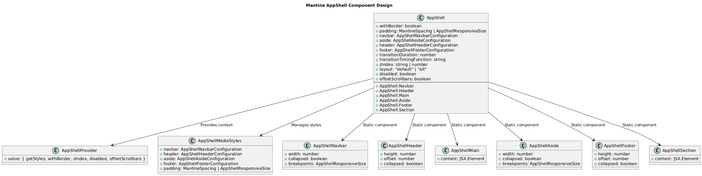
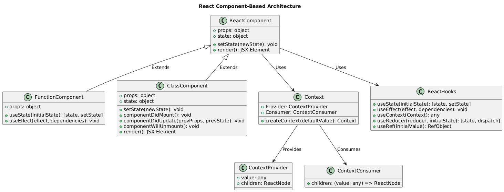

## Repository
https://github.com/mantinedev/mantine

## Appshell コンポーネント
MantineのAppShellコンポーネントは、Web開発におけるレイアウト構築の効率性と柔軟性を大幅に向上させ、モダンなWeb開発のパラダイムシフトをもたした。この設計は、従来の手動でのレイアウト構築やスタイル調整の煩雑さを解消した。

AppShellは、ナビゲーションバー、ヘッダー、メインコンテンツ、サイドバー、フッターといったWebアプリケーションの基本構成要素を統一的に管理する。



これにより、レスポンシブデザインやスタイルの一貫性が容易に実現され、複雑なレイアウト要件にも柔軟に対応可能。また、 AppShellProvider によるコンテキスト管理や AppShellMediaStyles によるスタイル調整は、コンポーネント間の依存関係を最小化し、再利用性を高める。

Reactのコンポーネントベースアーキテクチャも、UIを小さな再利用可能なコンポーネントに分割することを基本としている点で、 AppShell の設計と親和性が良い。



MantineAppShellProvider は、 ReactのContextAPI を活用しており、状態管理やプロパティの受け渡しを簡潔に行えるよう設計されている。これにより、親コンポーネントから子コンポーネントへのプロパティの「バケツリレー」を避け、コードの可読性と開発効率が向上する。特に、 useDisclosure は、シンプルな状態管理をカプセル化し、開閉状態を管理するための便利な API を提供している。このようなカスタムフックを活用することで、状態管理ロジックを再利用可能にしている。このような抽象化と汎用性の組み合わせは、 Web アプリケーションの開発速度を加速させる。

```ts
import { useCallback, useState } from 'react';

export function useDisclosure(
  initialState = false,
  callbacks?: { onOpen?: () => void; onClose?: () => void }
) {
  const { onOpen, onClose } = callbacks || {};
  const [opened, setOpened] = useState(initialState);

  const open = useCallback(() => {
    setOpened((isOpened) => {
      if (!isOpened) {
        onOpen?.();
        return true;
      }
      return isOpened;
    });
  }, [onOpen]);

  const close = useCallback(() => {
    setOpened((isOpened) => {
      if (isOpened) {
        onClose?.();
        return false;
      }
      return isOpened;
    });
  }, [onClose]);

  const toggle = useCallback(() => {
    opened ? close() : open();
  }, [close, open, opened]);

  return [opened, { open, close, toggle }] as const;
}
```
mantine/packages/@mantine/hooks/src/use-disclosure/use-disclosure.ts